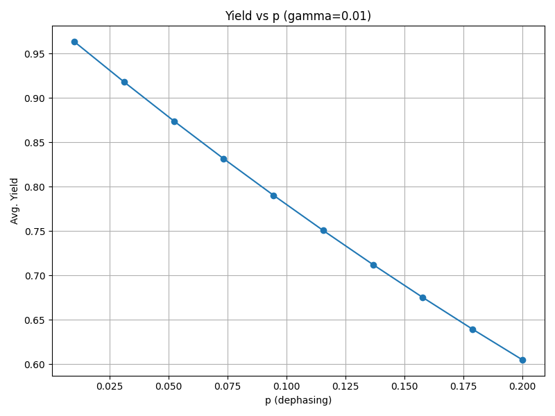

# Purification_Simulation

This repository contains a Monte Carlo simulation of adaptive vs. static entanglement purification over noisy fiber‐optic channels (amplitude‐ and phase‐damping).  All of the generated plots live under `images/`.  Below, you will find:

- A list of all images (file names) in `images/` and what each one illustrates.
- Step‐by‐step instructions on how to install dependencies and run the code to reproduce the data and plots.

---

## Images

Below are all of the plots located in the `images/` folder. Each image is embedded so you can see it directly in the README. The relative path to each file is `images/<filename>.png`.

---

#### `fidelity_surface.png`  
*3D surface plot of average purified‐pair fidelity (adaptive protocol) as a function of amplitude‐damping (γ) and phase‐damping (p).*


---

#### `yield_surface.png`  
*3D surface plot of average purification yield (adaptive protocol) as a function of γ and p.*


---

#### `fidelity_contour.png`  
*2D contour map showing average purified‐pair fidelity (adaptive) over the (γ, p) grid.*


---

#### `yield_contour.png`  
*2D contour map showing average purification yield (adaptive) over the (γ, p) grid.*


---

#### `fidelity_vs_gamma.png`  
*Line plot of average purified‐pair fidelity vs. γ (for a fixed p) under the adaptive protocol.*


---

#### `yield_vs_gamma.png`  
*Line plot of average purification yield vs. γ (for a fixed p) under the adaptive protocol.*


---

#### `fidelity_vs_p.png`  
*Line plot of average purified‐pair fidelity vs. p (for a fixed γ) under the adaptive protocol.*


---

#### `yield_vs_p.png`  
*Line plot of average purification yield vs. p (for a fixed γ) under the adaptive protocol.*



---

#### `diff_fidelity_surface.png`  
*3D surface plot of the fidelity difference (adaptive minus default/static) over γ and p.*


---

#### `diff_yield_surface.png`  
*3D surface plot of the yield difference (adaptive minus default/static) over γ and p.*


---

#### `diff_fidelity_contour.png`  
*2D contour map of fidelity difference (adaptive – default/static) over the (γ, p) grid.*


---

#### `diff_yield_contour.png`  
*2D contour map of yield difference (adaptive – default/static) over the (γ, p) grid.*


---

#### `diff_fidelity_vs_gamma.png`  
*Line plot of fidelity difference vs. γ (for a fixed p).*


---

#### `diff_yield_vs_gamma.png`  
*Line plot of yield difference vs. γ (for a fixed p).*


---

#### `diff_fidelity_vs_p.png`  
*Line plot of fidelity difference vs. p (for a fixed γ).*


---

#### `diff_yield_vs_p.png`  
*Line plot of yield difference vs. p (for a fixed γ).*


---

## How to Run the Code

Below are step‐by‐step instructions to install all dependencies, run the simulation, extract data, and regenerate all plots.

> **Note:** All commands assume you are in the repository root.

### 1. Clone the Repository

```bash
git clone https://github.com/BillSkarlatos/Purification_Simulation.git
cd Purification_Simulation
```

### 2. Install Dependencies

```bash
pip install --upgrade pip
pip install -r deps.txt
```

### 3. Run the code

```bash
python main.py
python throughput_improvement.py
```
